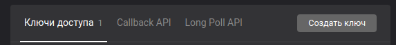

# VK Bot для домашней работы.

Установка:

```
# pip3 install vk_api
# git clone https://github.com/TheMaxMur/vk-bot-for-homework
# cd vk-bot-for-homework
```
После установки нужно будет добавить администратора в файл admins.txt

Просто скопируйте id страницы вк того, кого хотите сделать администратором и добавьте это в файл.

На стороне vk нужно сделать следующие пункты:

1) Создать группу в вк, и создать в ней токен.




2) Изменить версию Long Poll на 5.95.


Так же, надо будет добавить ваш токен, ваш id группы, и указать пути до файлов admins.txt и homework.txt в файле index.py.

После всех вышеперечисленных действий бота нужно запустить.

```
# python3 index.py
```